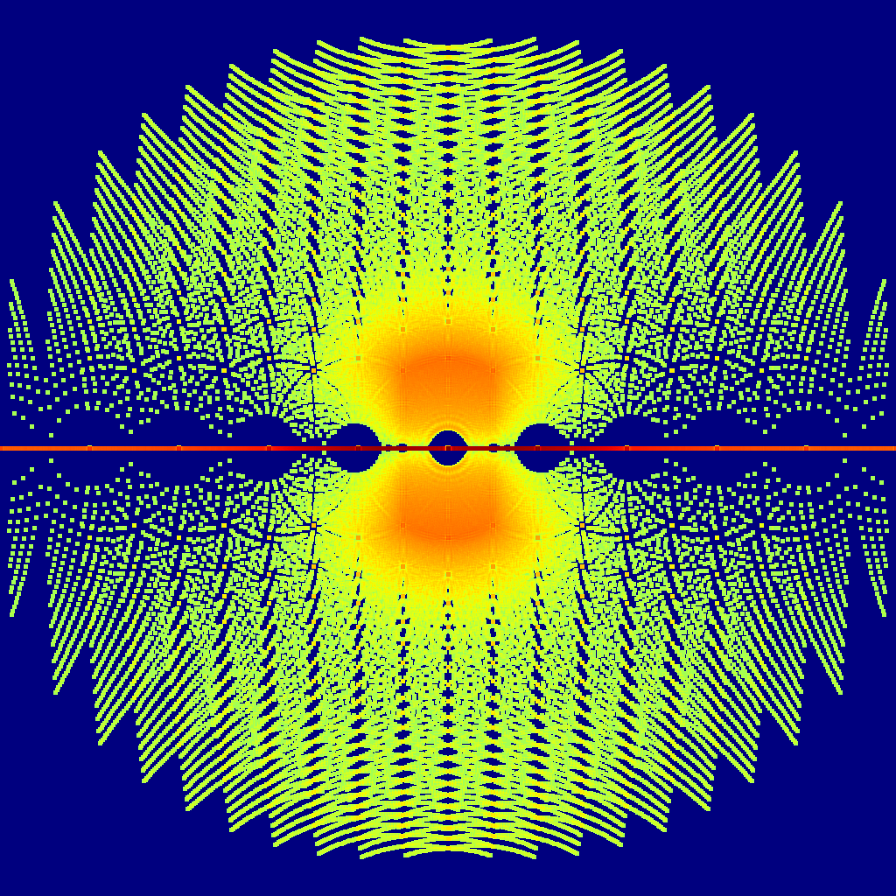

# durand_kerner
Durand-Kerner Method in Python with a little something extra that plots algebraic integers...

All those points correspond to the roots of polynomials of the form: p(x) = x^N sum_0^{N-1} a_n x^n, with a_n in {L,L+1,...,R-1,R}.
